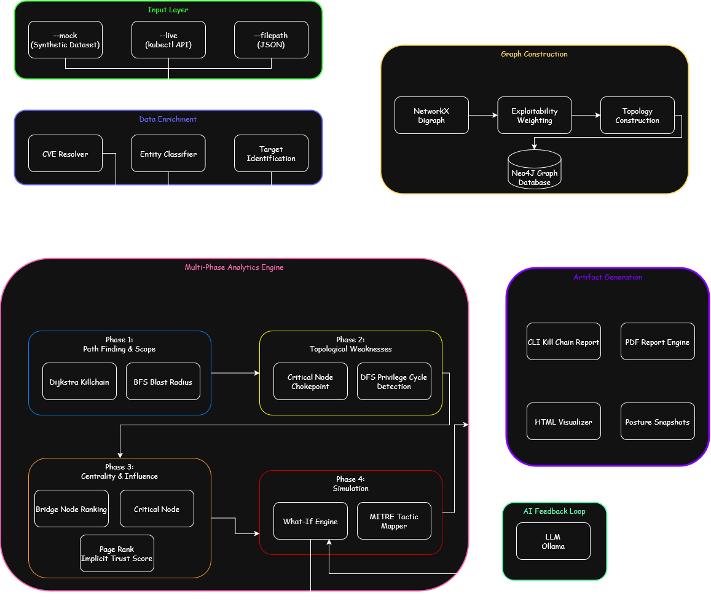
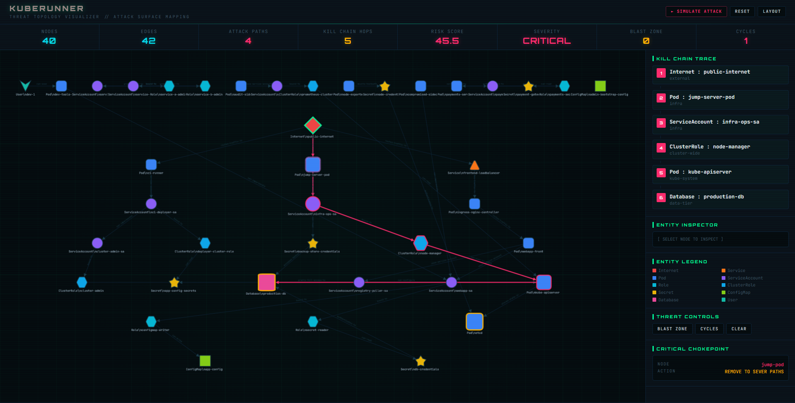
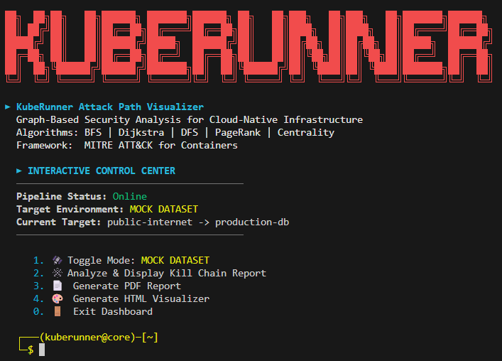
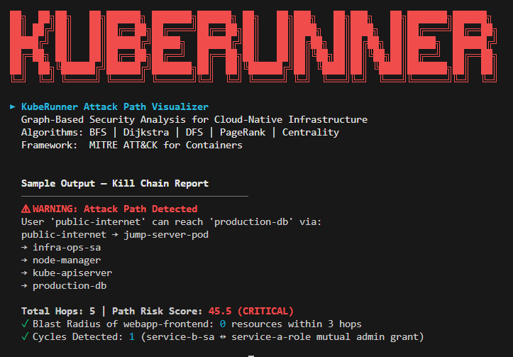
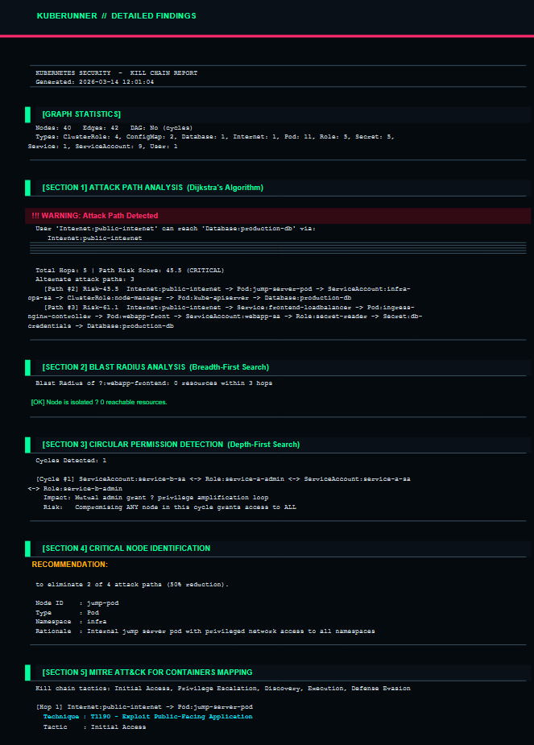

## Architecture Diagram

<p align="center">
  
</p>

<h1 align="center">Kubernetes Attack Path Visualizer</h1>

<p align="center">
  <strong>Graph-Based Security Analysis for Cloud-Native Infrastructure</strong>
</p>


<p align="center">
  A production-grade CLI tool that models Kubernetes clusters as directed graphs, applies classical graph algorithms to detect hidden multi-hop attack paths, and generates actionable <strong>Kill Chain Reports</strong> with MITRE ATT&CK mapping, adversary attack simulations, and cluster security scorecards.
</p>

---

## Feature Highlights

| Category | Features |
|---|---|
| **Core Algorithms** | BFS blast radius · Dijkstra shortest path · DFS cycle detection · Critical node identification |
| **Advanced Analytics** | Betweenness centrality · PageRank importance · Risk severity matrix · Namespace isolation audit |
| **Security Intelligence** | MITRE ATT&CK mapping · Automated remediation plan · Defense depth analysis |
| **Simulation** | Step-by-step adversary narrative · Time estimates · Privilege escalation tracking |
| **Scoring** | Cluster security scorecard (0-100) · Letter grade · 6 weighted categories |
| **Visualization** | Interactive Cytoscape.js graph · Animated attack walkthrough · Blast zone highlighting |
| **Temporal** | Snapshot saving · Graph diffing · New attack path alerting |
| **Output** | Coloured CLI report (8 sections) · SOC-style PDF · JSON export · HTML graph |

---

## 📸 Interactive Visualization

<p align="center">
  
</p>

> *40-node cluster graph with colour-coded entity types, attack kill chain sidebar, real-time stats bar, and interactive controls for blast zone / cycle highlighting.*

---

## 🚀 Quick Start

```bash
# Clone and enter
git clone https://github.com/Mayur404/KubeRunner.git
cd KubeRunner

# Set up environment
python -m venv venv
.\venv\Scripts\Activate.ps1          # Windows
# source venv/bin/activate            # macOS/Linux

# Install dependencies
pip install -r requirements.txt

# LAUNCH THE INTERACTIVE CONTROL CENTER
python main.py
```

---

## 🛰️ Interactive Control Center

<p align="center">
  
</p>
<p align="center">
  
</p>

KubeRunner features a **Target Control Center** — a premium terminal-based dashboard that eliminates the need for complex CLI flags. Just run `python main.py` and manage your entire security pipeline:

- **Toggle Mode:** Switch between Mock and Live clusters.
- **Run Pipeline:** Initialize ingestion, analysis, and scoring with one keypress.
- **Explore Results:** Trigger visualizer, generate PDF, or run simulations directly from the menu.
- **Goated Aesthetics:** High-contrast ANSI colors, emojis, and status indicators.

---

##  Premium Visualizer (Cyberpunk SOC Mode)

- **Visuals:** Scanline overlays, glitch animations, and a hexagonal grid background.
- **Typography:** Orbitron and JetBrains Mono for a high-tech technical feel.
- **Interactivity:** "Simulate Attack" hop-by-hop animations and "Blast Radius" highlighting.
- **Metrics:** Pulsing status bar with real-time node/edge/path counts.

### 📸 Visualizer Preview
<p align="center">
  
</p>

##  Kill Chain Report PDF
<p align="center">
  
</p>

---

## 🏗️ How It Works

The tool operates as a **4-stage pipeline**:

```
┌──────────┐     ┌──────────┐     ┌──────────────┐     ┌─────────────┐
│ INGESTOR │────▶│  GRAPH   │────▶│   ANALYZER   │────▶│  REPORTER   │
│          │     │ BUILDER  │     │              │     │             │
│ kubectl  │     │ NetworkX │     │ BFS          │     │ CLI Report  │
│ or JSON  │     │ DiGraph  │     │ Dijkstra     │     │ PDF Report  │
│ + CVE DB │     │          │     │ DFS          │     │ JSON Export │
└──────────┘     └──────────┘     │ Centrality   │     └─────────────┘
                                  │ PageRank     │
                                  │ Critical Node│     ┌─────────────┐
                                  └──────────────┘────▶│ VISUALIZER  │
                                                       │ (HTML)      │
                                                       └─────────────┘
```

**Stage 1 — Ingest:** Load cluster state from JSON (mock) or `kubectl` (live). Enrich nodes with CVE data from a local vulnerability database.

**Stage 2 — Build:** Construct a NetworkX `DiGraph`. Every Kubernetes entity becomes a node; every trust relationship becomes a directed edge with an exploitability weight.

**Stage 3 — Analyse:** Run 8 graph algorithms to detect attack paths, blast radius, permission cycles, chokepoints, and node importance.

**Stage 4 — Report:** Generate an 8-section Kill Chain Report (CLI + PDF), interactive HTML visualization, and machine-readable JSON.

---

## 📂 Project Structure

```
kuberunner/
│
├── main.py                   # CLI entry point — 16 flags, orchestrates pipeline
├── ingestor.py               # Data loading from JSON / kubectl + CVE enrichment
├── graph.py                  # NetworkX DiGraph builder + crown jewel detection
├── analyzer.py               # 8 algorithms (BFS, Dijkstra, DFS, centrality, etc.)
├── reporter.py               # 8-section coloured CLI report + PDF generation
│
├── mitre_mapper.py           # MITRE ATT&CK technique database + remediation
├── simulator.py              # Attack simulation engine with adversary narrative
├── scorecard.py              # Security scorecard (0–100, A–F letter grade)
├── visualizer.py             # Interactive Cytoscape.js HTML graph
├── temporal.py               # Snapshot save/diff for temporal analysis
│
├── mock-cluster-graph.json   # 40-node synthetic cluster dataset
├── schema.md                 # JSON schema documentation
├── requirements.txt          # Python dependencies
├── LICENSE                   # MIT License
├── .gitignore                # Git ignore rules
├── docs/
│   ├── architecture.png      # Architecture diagram
│   ├── visualization.png     # Interactive graph screenshot
│   └── sample_output.txt     # Full sample CLI output
│
└── tests/
    └── test_algorithms.py    # 30 unit tests
```

---

## 📊 Graph Data Model

The cluster is modelled as a **directed weighted graph**:

| Concept | Graph Element | Examples |
|---|---|---|
| Cluster Entity | **Node** | Pod, ServiceAccount, Role, ClusterRole, Secret, Database, User |
| Trust Relationship | **Directed Edge** | `uses-service-account`, `can-read`, `bound-to`, `authenticates-to` |
| Exploitability | **Edge Weight** | Lower = easier to exploit (1.0 = trivial, 10.0 = difficult) |
| Crown Jewel | **Sink Node** | Production Database, Secret Store, etcd |
| Entry Point | **Source Node** | Internet-facing Service, LoadBalancer |

**Node attributes:**
```python
{
    "type": "Pod",               # Entity type (10 types supported)
    "name": "webapp-front",      # Human-readable name
    "namespace": "default",      # Kubernetes namespace
    "risk_score": 8.1,           # CVSS score if CVE present
    "cve": "CVE-2024-1234",      # Known vulnerability ID
    "description": "...",        # What this entity does
    "is_crown_jewel": False      # High-value target flag
}
```

**Edge attributes:**
```python
{
    "relationship": "uses-service-account",   # Trust relationship type
    "weight": 1.0                             # Exploitability score
}
```

---

## 🔬 Module-by-Module Deep Dive

### `ingestor.py` — Data Ingestion

Loads cluster state and enriches nodes with vulnerability data.

**Two modes:**
- **`--mock`** (default): Reads `mock-cluster-graph.json` — 40 nodes, 42 edges, 6 pre-planted attack paths
- **`--live`**: Queries a real Kubernetes cluster via `kubectl get pods|rolebindings|clusterrolebindings|secrets -A -o json`

**CVE Enrichment:** Checks each node for a `cve` field and looks up the CVSS score in a local mock database (7 CVEs including Log4Shell, Nginx RCE, etcd leak). For production, this can be extended to query the NIST NVD API.

---

### `graph.py` — Graph Construction

Converts raw JSON into a NetworkX `DiGraph`.

**Key methods:**
| Method | Returns |
|---|---|
| `get_graph()` | The NetworkX DiGraph object |
| `get_source_nodes()` | All entry-point nodes (Internet, Service) |
| `get_crown_jewel_nodes()` | All high-value targets (Database, Secret) |
| `summary()` | Node/edge counts, DAG status, crown jewels |

---

### `analyzer.py` — 8 Graph Algorithms

The core analysis engine implementing all required and advanced algorithms.

#### Algorithm 1 — Blast Radius (BFS)
**Purpose:** "If this pod is compromised, how far can the attacker reach?"

Runs BFS from a compromised node up to N hops (configurable). Returns all reachable resources grouped by hop distance — the "danger zone" for incident response.

```
Compromised: dev-tools-pod
  Hop 1: webapp-sa           (reads mounted SA token)
  Hop 2: secret-reader       (SA is bound to this role)
         configmap-writer    (SA is bound to this role)
  Hop 3: db-credentials      (role can read this secret)
         app-config          (role can write this configmap)
→ 5 resources at risk within 3 hops
```

#### Algorithm 2 — Shortest Attack Path (Dijkstra)
**Purpose:** "What is the easiest route from the internet to the production database?"

Finds the lowest-cost path where cost = Σ(edge weights) + Σ(node risk scores). Lower cost = most dangerous path.

```
Risk Score Calculation:
  Edge weights:    7.0 + 7.0 + 1.0 + 1.5 + 8.0 = 24.5
  Node CVSS:       0.0 + 0.0 + 0.0 + 0.0 + 0.0 + 10.0 + 11.0 = 21.0
  Total:           45.5 (CRITICAL)
```

#### Algorithm 3 — Circular Permissions (DFS)
**Purpose:** "Are there mutual admin grants that create privilege escalation loops?"

Uses DFS cycle detection to find permission loops like `SA-A → Role-B → SA-B → Role-A → SA-A`. Compromising ANY node in a cycle grants access to ALL other nodes in the cycle.

#### Algorithm 4 — Critical Node Identification
**Purpose:** "Which single permission should we revoke for maximum impact?"

For every intermediate node on all attack paths, simulates removal via read-only subgraph. Reports the node whose removal eliminates the most paths:

```
RECOMMENDATION:
Remove 'ServiceAccount:infra-ops-sa' to eliminate 2 of 4 attack paths (50% reduction).
```

#### Algorithm 5 — Betweenness Centrality
Identifies chokepoint nodes that appear in the most shortest paths between all node pairs. High-centrality nodes are priority hardening targets.

#### Algorithm 6 — PageRank / Node Importance
Ranks nodes by implicit trust received from the rest of the graph (weighted in-degree). High-PageRank nodes are the most impactful targets if compromised.

#### Algorithm 7 — Namespace Isolation Audit
Scans every edge for cross-namespace trust relationships. Each violation is a potential segmentation issue enabling lateral movement.

#### Algorithm 8 — What-If Remediation Simulator
Simulates removing a node and compares the attack surface before vs. after. Shows broken paths and remaining paths with percentage reduction.

---

### `reporter.py` — Kill Chain Report (8 Sections)

Generates coloured CLI output matching the hackathon sample format, plus a professional multi-page PDF.

| Section | Algorithm | What It Shows |
|---|---|---|
| Graph Stats | — | Node/edge counts, type distribution, DAG status |
| 1. Attack Path | Dijkstra | Kill chain with → arrows, hop count, risk score |
| 2. Blast Radius | BFS | Per-hop resource listing from compromised node |
| 3. Cycles | DFS | Permission loops with impact description |
| 4. Critical Node | Path Counting | Removal recommendation with path reduction % |
| 5. MITRE Map | Technique DB | Each hop → ATT&CK technique + tactic |
| 6. Analytics | Centrality/PageRank | Risk histogram, chokepoint rankings |
| 7. Remediation | MITRE Mitigations | 15 prioritised security actions |
| 8. Namespace | Cross-NS Audit | Segmentation violations between namespaces |

**Sample output format:**
```
!!! WARNING: Attack Path Detected
User 'Internet:public-internet' can reach 'Database:production-db' via:
   Internet:public-internet
   -> Pod:jump-server-pod
   -> ServiceAccount:infra-ops-sa
   -> ClusterRole:node-manager
   -> Pod:kube-apiserver
   -> Database:production-db

Total Hops: 5 | Path Risk Score: 45.5 (CRITICAL)
```

**PDF features:** Dark cover page, table of contents, colour-coded section headers, warning highlights, confidentiality footer.

---

### `mitre_mapper.py` — MITRE ATT&CK Mapping

Maps every edge relationship to a real ATT&CK for Containers technique:

| Relationship | ATT&CK ID | Tactic |
|---|---|---|
| `routes-traffic-to` | T1190 | Initial Access |
| `uses-service-account` | T1078.004 | Privilege Escalation |
| `bound-to` | T1613 | Discovery |
| `can-read` | T1552.007 | Credential Access |
| `can-exec` | T1609 | Execution |
| `grants-admin-to` | T1098 | Persistence |
| `mounts-hostpath` | T1611 | Defense Evasion |
| `can-impersonate` | T1550 | Lateral Movement |
| `authenticates-to` | T1552 | Credential Access |
| `can-configure` | T1578 | Defense Evasion |

Each technique includes 3 remediation actions generated by `generate_remediation_plan()`.

---

### `simulator.py` — Attack Simulation Engine

Generates a step-by-step adversary narrative with:
- **Time estimates** per step (e.g., "~30 seconds to read SA token from /var/run/secrets")
- **Privilege escalation** tracking (NONE → CONTAINER → API-AUTH → CLUSTER-ADMIN → DATA-OWNER)
- **Decision rationale** explaining what the attacker does at each hop
- **Difficulty rating** (TRIVIAL / EASY / MODERATE / HARD) based on edge weight
- **MITRE technique** reference per lateral movement step

```
--- Step 3: LATERAL MOVEMENT via uses-service-account ---
Target     : ServiceAccount:infra-ops-sa (ns: infra)
Privilege  : API-AUTHENTICATED (SA token)
Time       : ~30 seconds (read mounted SA token from /var/run/secrets)
Difficulty : HARD
ATT&CK     : T1078.004 - Valid Accounts: Cloud Accounts

> Inside the compromised container, the attacker reads the mounted
  ServiceAccount token from /var/run/secrets/kubernetes.io/serviceaccount/token.
```

---

### `scorecard.py` — Cluster Security Scorecard

Aggregates all findings into a single **0-100 score** with a letter grade:

| Category | Max Points | What It Measures |
|---|---|---|
| Attack Paths | 30 | Number of discoverable paths (fewer = better) |
| CVE Exposure | 20 | Known CVEs and their severity |
| Privilege Loops | 15 | Permission cycles enabling escalation |
| Namespace Isolation | 15 | Cross-namespace trust violations |
| Defense Depth | 10 | Independent barriers per attack path |
| Critical Exposure | 10 | Path concentration through fixable nodes |

**Grading:** A (90+) · B (80+) · C (70+) · D (60+) · **F** (<60)

The mock cluster scores **21.5/100 (Grade F)** — correctly identifying severe exposure.

---

### `visualizer.py` — Interactive Graph

Generates a self-contained HTML file using **Cytoscape.js**:

- **Colour-coded nodes** by entity type (10 colours/shapes)
- **Attack path highlighting** with red borders and edges
- **"Animate Attack" button** — steps through kill chain hop-by-hop
- **"Show Blast Zone"** — highlights BFS-reachable nodes
- **"Show Cycles"** — highlights permission loop nodes
- **Node inspector** — click any node for details
- **Layout toggle** — force-directed vs hierarchical
- **Stats bar** — live node/edge/path/risk metrics

---

### `temporal.py` — Temporal Analysis

Enables security posture tracking over time:

1. **`--snapshot`**: Saves current graph state + analysis to `snapshots/snap_YYYYMMDD_HHMMSS.json`
2. **`--diff PREV_FILE`**: Loads a previous snapshot and reports:
   - New/removed nodes and edges
   - Newly introduced attack paths
   - New/resolved permission cycles
   - Risk score delta

**Use case:** Schedule nightly scans. If a new RoleBinding opens a path to `production-db`, the diff flags it immediately.

---

## 🧪 Testing

```bash
python -m pytest tests/test_algorithms.py -v
```

**30 unit tests** across 9 categories on deterministic small graphs:

| Category | Tests | What's Verified |
|---|---|---|
| BFS Blast Radius | 6 | Hop counts, layering, branching, non-existent nodes |
| Dijkstra | 5 | Path correctness, weight preference, reverse path, empty graph |
| DFS Cycles | 4 | Cycle detection, no false positives, empty graph |
| Critical Node | 2 | Linear chain, branching with cross-links |
| Risk Rating | 5 | All 5 CVSS threshold boundaries |
| Centrality | 2 | Linear graph, empty graph |
| Namespace Isolation | 2 | Cross-NS detection, same-NS no false positive |
| What-If | 2 | Bottleneck removal (100%), non-existent node (no crash) |
| Edge Cases | 2 | Single isolated node, empty graph |

---

## 📋 CLI Reference

```
python main.py [OPTIONS]

DATA SOURCE:
  --mock                    Use built-in 40-node mock dataset (default)
  --live                    Scrape live cluster via kubectl
  --filepath FILE           Path to custom JSON cluster graph

ANALYSIS TARGETS:
  --source NODE_ID          Entry point (default: public-internet)
  --target NODE_ID          Crown jewel target (default: production-db)
  --blast-source NODE_ID    Blast radius start node (default: dev-pod)
  --blast-hops N            Max BFS traversal depth (default: 3)

OUTPUT:
  --pdf FILE                PDF output path (default: Kill_Chain_Report.pdf)
  --no-pdf                  Skip PDF generation (console only)
  --export-json FILE        Export full results as JSON
  --list-nodes              Print all cluster nodes and exit

ADVANCED:
  --visualize               Generate interactive HTML graph
  --full-scan               Auto-scan all entry × crown jewel pairs
  --snapshot                Save graph snapshot for temporal diffing
  --diff PREV_FILE          Diff current state against previous snapshot
  --simulate                Run adversary attack simulation narrative
  --scorecard               Generate cluster security scorecard (0-100)
  --what-if-remove NODE_ID  Simulate removing a node, show impact
```

---

## 🗄️ Mock Dataset

`mock-cluster-graph.json` — **40 nodes · 42 edges · 6 attack paths · 1 cycle · 7 CVEs · 11 namespaces**

### Pre-Planted Attack Paths

| # | Kill Chain | Severity |
|---|---|---|
| 1 | `public-internet` → nginx → webapp → SA → role → secret → **production-db** | CRITICAL |
| 2 | `public-internet` → ci-pod → ci-sa → admin-sa → cluster-admin → apiserver → **etcd** | CRITICAL |
| 3 | `public-internet` → jump-pod → infra-sa → node-manager → apiserver → **production-db** | CRITICAL |
| 4 | `dev-user` → dev-pod → webapp-sa → role → db-secret → **production-db** | HIGH |
| 5 | node-exporter → hostpath-secret → **etcd** | CRITICAL |
| 6 | attacker-pod → payments-sa → role → payments-secret → **payments-pod** | HIGH |

See [`schema.md`](schema.md) for the complete JSON schema documentation.

---

## ⚙️ Dependencies

```
networkx>=3.2.1    # Graph algorithms
fpdf2>=2.7.9       # PDF report generation
colorama>=0.4.6    # Coloured terminal output
numpy>=1.26        # PageRank computation backend
pytest>=7.0        # Unit tests
kubernetes>=30.1.0 # Live cluster client (optional)
```

---